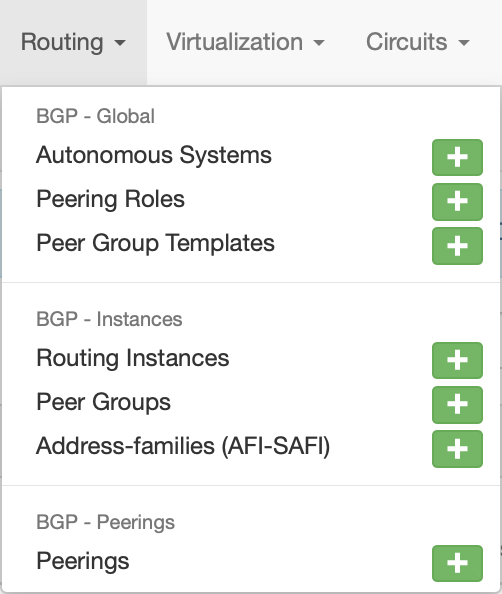
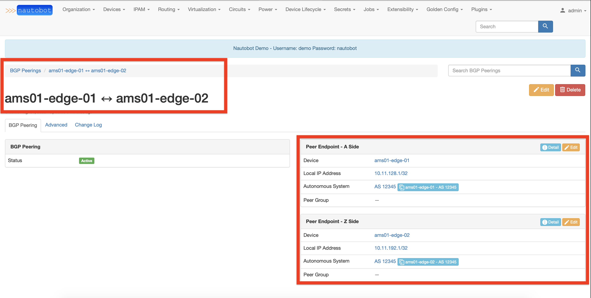
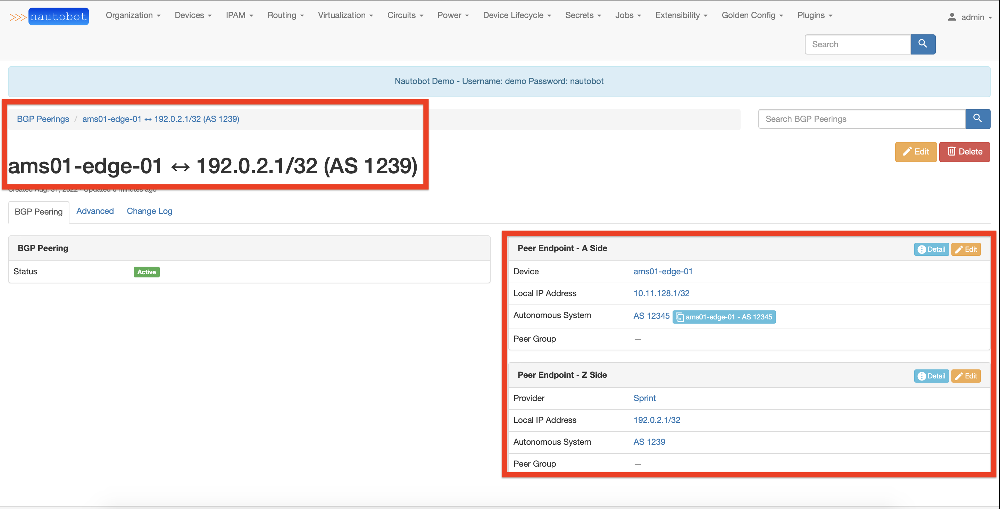

# Introduction

Below shows the workflows for the two most common BGP Plugin use cases: modeling internal and external peering. We will showcase how to create each type of peering with the minimum number of steps and inputs required from users.

## Menu Item

All of the "Add object" actions are available under BGP Models Plugin Menu in the top navigation bar:

## Internal Peering Creation

To model an internal peering (two devices sharing the same ASN), following has to be defined for two BGP speaker devices:

- a BGP Routing Instance
- IP Address of an endpoint

Note that having a BGP Routing Instance is not mandatory, however we recommend creating this object for devices modeled in Nautobot.

### Autonomous System Creation

The first step is to add an Autonomous System object (via the top menu).

Fill the object details:

### BGP Routing Instances creation

The next step is to create a BGP Routing Instance for each device of an internal BGP peering.
A BGP Routing Instance itself is a representation (or a declaration) of a BGP process on a given device.

Fill the object details:

Repeat for next devices and check the overall result in the BGP Routing Instance list view:

### Peering creation

Under the menu "BGP Peerings - Peerings" click on the "Add" button to add a new peering.
You will be redirected to a view with two columns in a table, each column representing one side of a BGP peering.
To create a BGP Peering, you have to complete information for two sides.

To create an internal BGP Peering, you only need to specify an existing BGP Routing Instance and an IP Address.

### Peering detail view

Once the BGP Peering is created, you could review its details.

## External Peering Creation

To model an external peering (two devices having different ASN), the following has to be defined:

- For a device present in Nautobot:
    - a BGP Routing Instance
    - IP Address of an endpoint

- For a device not present in Nautobot:
    - an Autonomous System
    - IP Address of an endpoint

The steps required to create an internal peer have been explained in the previous section.

### Autonomous System Creation - for Provider

The first step is to add an Autonomous System object for a Provider.
Fill in the object details and ensure the optional field "Provider" is filled.

### Peering creation

Once the Autonomous System and BGP Routing Instance objects have been created you are ready to create a peering between two devices.
Under the menu "BGP Peerings - Peerings" click on the "Add" button to add a new peering.
You will be redirected to a view with two columns in a table, each column representing one side of a BGP peering.
To create a BGP Peering, You have to complete information for both sides.

To create an external BGP Peering, for the Provider's side You have to fill in the information with the Provider's ASN and IP Address of the provider's endpoint.

### Peering detail view

Once the BGP Peering is created, you could review its details.

