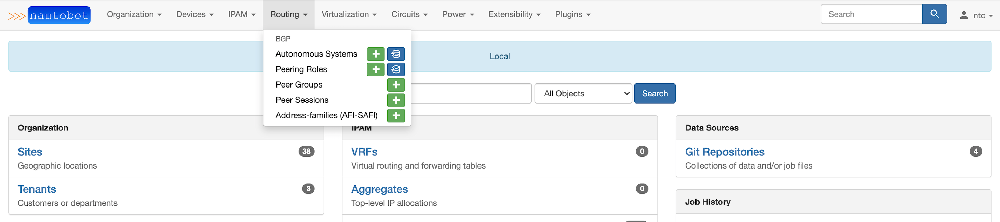
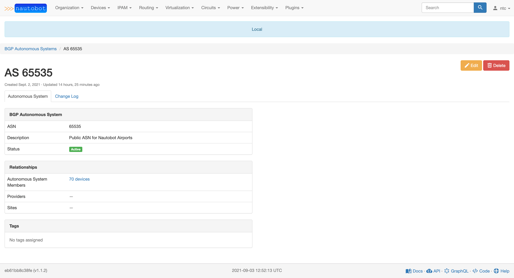
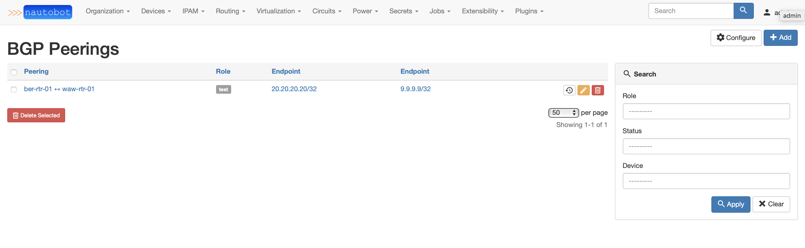
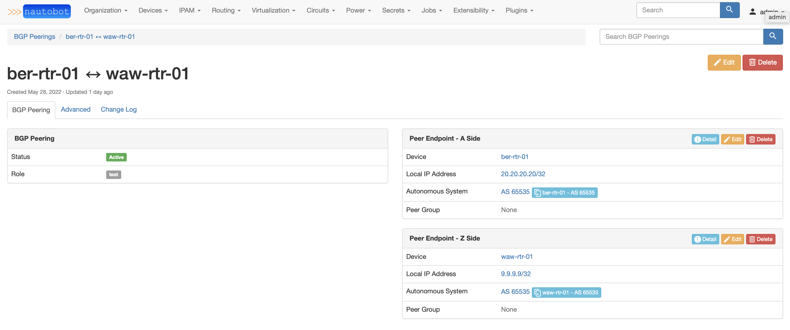
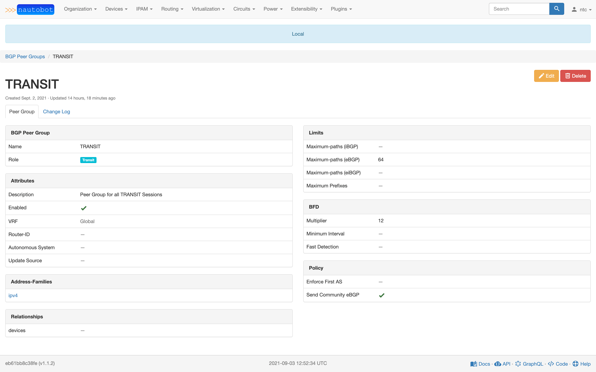

# Using the App

This document describes common use-cases and scenarios for this App.

## Use-cases and common workflows

To make getting started with the plugin easier, we provide example use-cases for two common OS platforms: Cisco and Juniper.

### Cisco Configuration Modeling and Rendering

Navigate to [Cisco Example Use Case](cisco_use_case.md) for detailed instructions how to consume BGP Models plugin on Cisco devices.

### Juniper Configuration Modeling and Rendering

Navigate to [Juniper Example Use Case](juniper_use_case.md) for detailed instructions how to consume BGP Models plugin on Juniper devices.

## Screenshots

### Routing Menu

### Autonomous System

### Peering List

### BGP Peering

### Peer Endpoint

### Peer Group

